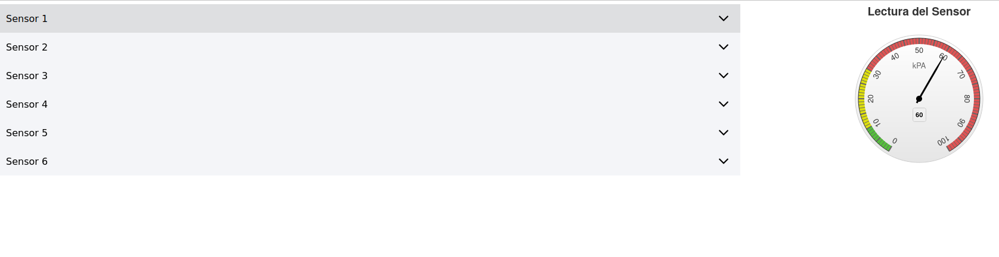
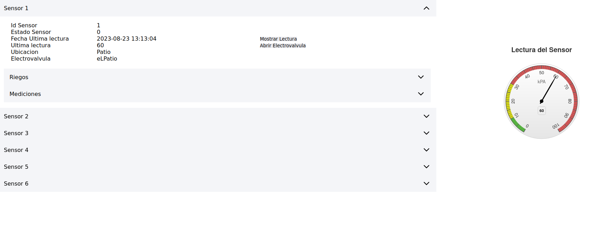
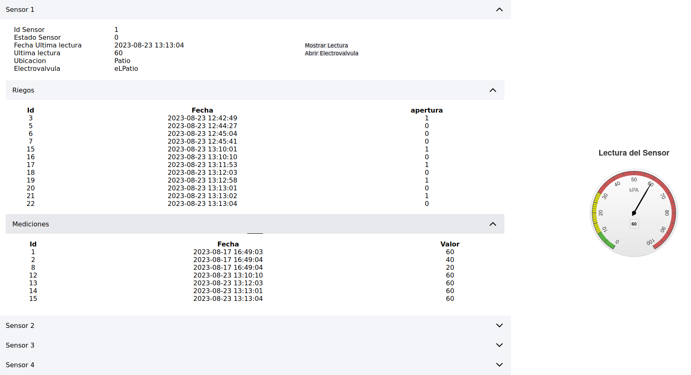

# Universidad de Buenos Aires - Especializacion en Internet de las Cosas
## Asignatura Desarrollo de Aplicaciones Multiplataforma
## Trabajo Practico integrador
### Alumno Gonzalo Carreno
========================================

Pasos para ejecutar el proyecto

1) Ejecutar el comando npm install
2) Levantar el proyecto mediante docker-compose up: Esto debería crear el contenedor con la aplicación instalando las dependencias necesarias.
3) Ejecutar los scrpits de carga estructuras y datos provistos en el directorio "db" mediante la interfaz web de MySQL publicada en http://localhost:8001
4) Acceder al frontend en http://localhost:8100 y ejecutar la aplicación.

Notas del diseño del sistema:
=========================================

Componentes:
- Directiva showReading: es una directiva custom que permite renderizar la última lectura en el componente gráfico
- Pipe formatDate: es un pipe custom que permite formatear un objeto date/datetime en un formato agradable para el usuario
- Service listadoService: implementa la comunicación con el backend y entre los componentes gráficos mediante Observables.
- Componentes:
   - Detalle-Sensor: abstrae el componente gráfico donde se renderizan las lecturas
   - Listado: es el componente principal del listado de dispositivos, mediciones y riegos implementado con Ionic Accordions
- Interfaces
   - Dispositivo
   - Medición
   - Riego

APIs provistas en Express:
- GET /api/devices/
- GET /api/mediciones/
- GET /api/mediciones/last/<idDevice>
- GET /api/riegos/
- GET /api/riegos/last/<idDevice>
- POST /api/mediciones/
- POST /api/riegos/

Sobre las funcionalidades
==============================================
Las funcionalidades provistas son:
- Listado de los dispositivos
- Permitir ver mediciones y registros de riego por dispositivo
- Renderizar la última lectura en el componente gráfico
- Permitir abrir y cerrar la electroválvula del dispositivo
   - insertando un nuevo registro de riego del evento
   - en caso de que se este cerrando la electroválvula además insertar una nueva medición

Consideraciones para el cumplimiento de los requerimientos
==========================================================
- Dentro de la información brindada para cada dispositivo listado se agrega el estado de su electroválvula, pudiendo ser 0 (cerrado) o 1 (abierto). De esta forma se simplifica la gestión de la apertura y cierre, así como la determinación si insertar o no una nueva medición.
- Debido a que la carga inicial de datos presenta varios riegos y mediciones con el mismo timestamp se toma como decisión de disenio para la query SQL que busca los dispositivos con la última lectura, considerar la última y además la mayor en valor nominal.
- Las directivas estructurales Angular usadas fueron ngFor (para listar los dispositivos, riegos y mediciones en el componente principal de listado) y ngIf para ocular o visualizar el Ionic Accordion en base a sus elementos. También se la utilizó para decidir si visualizar el botón de operar con la Electroválvula para Abrir o Cerrar.

Algunas capturas de pantalla del producto terminado:
===================================================

Accediendo al home del proyecto en http://localhost:8100

Luego al navegar los distintos dispositivos podemos apreciar la información de cada uno, su estado y los botones disponibles para renderizar la última lectura y abrirla electroválvula. Notas que igualmente al desplegar el sensor el valor de su última lectura se renderiza en el componente gráfico automáticamente.

Luego podemos explorar las diferentes mediciones y riegos disponibles para cada sensor. En caso de no contar con ninguno se oculta el menú accordion.

